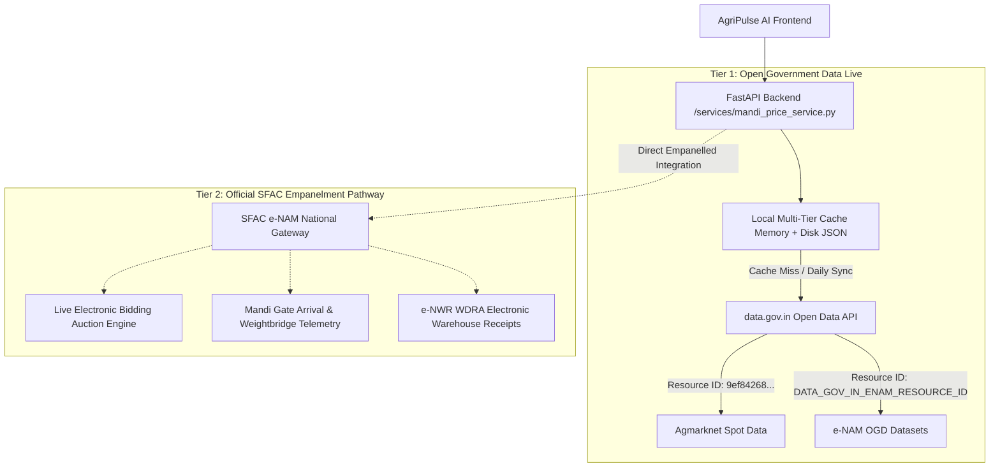

# AgriPulse AI — e-NAM (National Agriculture Market) Integration Roadmap

## 🏛️ Executive Summary & Context
**National Agriculture Market (e-NAM)** is an all-India electronic trading portal that networks the existing APMC mandis to create a unified national market for agricultural commodities.

Unlike Agmarknet (which publishes daily spot records as open government data on [data.gov.in](https://data.gov.in)), **e-NAM does not offer a self-serve public open API** for third-party write operations or real-time live trading feeds. Direct system integration with e-NAM requires formal institutional empanelment through the Government of India's official RFQ process.

AgriPulse AI utilizes a **Two-Tier Integration Architecture**:
- **Tier 1 (Live in App)**: Ingestion of official Open Government Data (OGD) datasets via `data.gov.in` and automated caching for e-NAM linked APMCs.
- **Tier 2 (Enterprise Empanelment Pathway)**: Institutional empanelment with SFAC to unlock direct bidirectional electronic trade auctions, e-NWR storage receipts, and live gate arrival telemetry.

---

## 🏗️ Two-Tier Integration Architecture

---

## 📋 Tier 2: Service Provider Empanelment Roadmap

### 1. Lead Implementing Agency
- **Agency**: Small Farmers Agribusiness Consortium (SFAC)
- **Ministry**: Department of Agriculture & Farmers Welfare, Ministry of Agriculture & Farmers Welfare, Government of India
- **Official Portal**: [https://enam.gov.in](https://enam.gov.in)
- **Reference Tender/Notice**: *"Empanelment of Service Providers for integration with National Agriculture Market (e-NAM)"* (published under `enam.gov.in/web/resources/tenders`).

### 2. Integration Scope & Functional Modules
When empanelment is granted, the following direct APIs are unlocked:
1. **Gate Inward & Electronic Weighment**: Real-time mandi arrivals telemetry by lot and vehicle number.
2. **NABL Assaying & Quality Telemetry**: Direct ingestion of parameter-wise lab assay results (moisture, foreign matter, grain size).
3. **Electronic Auction & Bidding Floor**: Direct participation in e-NAM trade matching engine and escrow settlements.
4. **Electronic Negotiable Warehouse Receipts (e-NWR)**: Integration with WDRA accredited storage providers for post-harvest pledge financing.

### 3. AgriPulse AI Codebase Readiness
The codebase has been designed with modular drop-in interfaces:
- [`backend/services/mandi_price_service.py`](file:///C:/Users/hp/.gemini/antigravity/scratch/agripulse-ai/backend/services/mandi_price_service.py): Ready to switch upstream data source via `DATA_GOV_IN_ENAM_RESOURCE_ID` or direct SFAC OAuth2 endpoint credentials without refactoring frontend consumers.
- [`backend/routers/enam.py`](file:///C:/Users/hp/.gemini/antigravity/scratch/agripulse-ai/backend/routers/enam.py): Standardized schema compliant with e-NAM and NDSAP open government standards.
- [`frontend/src/pages/ArbitragePage.jsx`](file:///C:/Users/hp/.gemini/antigravity/scratch/agripulse-ai/frontend/src/pages/ArbitragePage.jsx): 3-Way side-by-side market comparison engine ready to render electronic vs physical market spreads.

---

## ⚖️ Compliance & Attribution Requirements
Under National Data Sharing and Accessibility Policy (NDSAP) guidelines:
- All e-NAM displays must feature the mandatory attribution:
  > *"Source: National Agriculture Market (e-NAM), Ministry of Agriculture & Farmers' Welfare, Government of India"*
- Mandi coverage counts must be dynamically evaluated from live data feeds rather than hardcoded claims.
